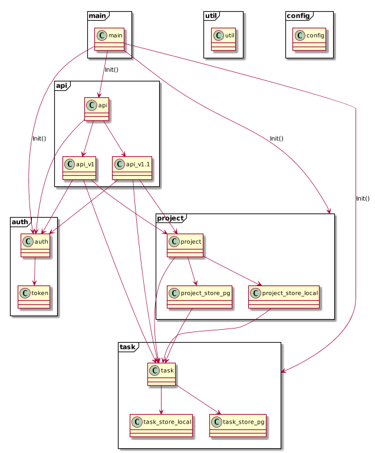

# Authentication

See the "authentication.md" file in this folder.

# Server architecture

The package name is named after the modeled **domain** (e.g. "project") and then contains **technical** files (e.g. "project_store_pg").

## Diagram

The `util` and `config` package are wildly used by multiple packages and are to lowest package in the hierarchy.

