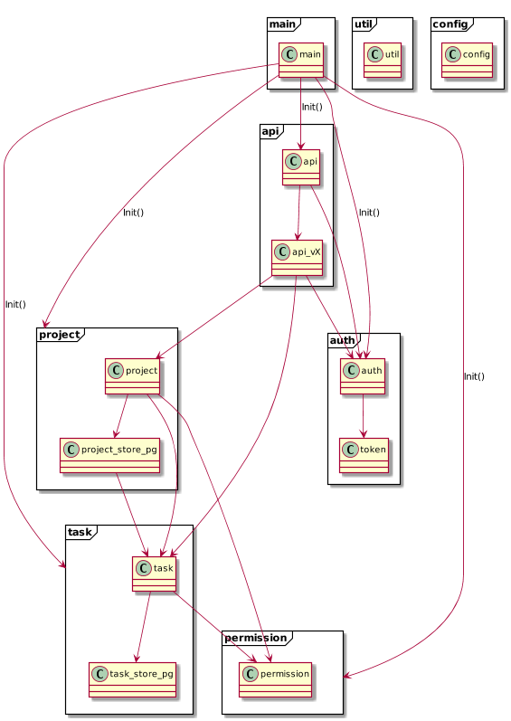

This file describes the general ideas of the overall code architecture, which is based on DDD (domain driven design).
It means, that the domain of the application (projects, tasks, users, etc.) determine how the code is structured.

# Client and server domain packages

Therefore client **and** server have both the domain specific top-level packages:

* project
* task

Within these domain-packages, there are different types of files:

* Server
    * service
    * material
    * store (postgresql connection)
* Client
    * service
    * material
    * UI components
    
The two **material** classes on the client and server are the same.
A material (or **entity** in DDD language) is just a class holding some data and there's no logic involved here.

The **client service** is mainly the connection to the server API and has nearly no logic in it.

The client **UI components** actually contain the main logic for their specific part of the application.
Example: The "TaskDetailsComponent" shows all relevant information for a task and also holds the input fields to set the process points.
Therefore the logic of setting these (basically the service call) is located there.

The **server services** are located in `project.go` and `task.go` and are called from the API classes.
They contain quite a lot of checking logic to allow specific actions (e.g. deleting a project) only to specific users.

This **permission** checking is performed in the `permission.go` used by these services.
The permission service uses both databases (for tasks and projects) to fully check different permissions, however, this service doesn't have any dependencies to the task and project package. 

The server **store** is basically what DDD calls a "repository" (a class saving data to a specific place).
I use the term "store" for that mainly because it's easier to type.

Here a server package use-graph:

# Server: Technical packages and files

Next to domain specific things, there're a lot of technical stuff as well.

## API

The folder `/api/` contains everything needed to set up the api.
Each version of the API has its own file (e.g. `api_v2_1` for API v2.1).
It' totally fine to use older service functions from newer API versions.
Example: The function `getProjects` was introduced in API v1 but is still used in v2 and v2.1.

Each API definition then has a reference to a function within the API file (so within `api_v2_1` or so).
This function gets all parameters, the body, the url segments, etc. and then calls the service.

**Technical checking** like "is parameter 'id' filled?" is also done here.
**Domain specific checking** like "is the user the owner of the project and is he then allowed to do this?" however is done in the service.

## Util files

There are some `util.go` files in the packages.
They can be used (or created/extended) when a small piece of functionality does either not fit into anything else or is used by different files within this package.
The util package then contains stuff that's used by multiple other packages and several other files.

# Client: Technical packages

There are basically two "technical" packages in the client.

* `common`: This is what the `util` package is on the server side: A place for code used by multiple other packages.
* `ui`: Here are custom created UI components like the toolbar or tabs control.

 