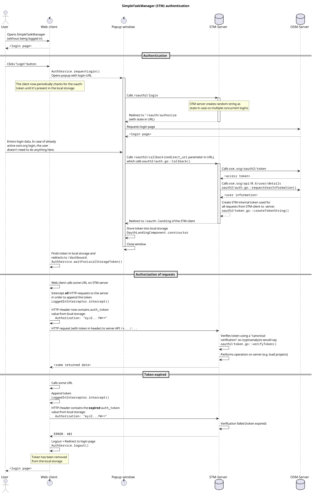

This file describes the process of authentication, token creation and token validation in the SimpleTaskManager.
We also take a look on technical aspects (what are the functions exactly doing) and on cryptographic basics (verification, security of the token, etc.).

# Login and authorization process

The easiest way to describe the process and the communication between all the servers is by showing you an diagram:



# Token generation and handling

STM does not use the OSM request- and access-tokens from the oauth process for two main reasons:

1. We would have to make requests to the OSM-Servers in order to validate the token. In a productive environment, this would result in thousands of requests per day. That's not good.
2. Having an own token enables us to store user data along with the secret part of the token (expiration date, permissions, roles, user name, etc.)

**Furthermore:**<br>
We can build a custom solution where the server does not has any state to store.
All the information is securely stored on the client (specifically the local storage of the browser).

## Encryption key

When the server starts, it initializes the authentication service (`auth.go:Init()`) and chooses an encryption key at random (precisely: The SHA-256 hash of 256 random bytes).
This key is later used when creating the secret of a token.

## Token structure

A token consists of three fields:

| Struct field name | JSON name | Type | Description |
| ----------------- | --------- | ---- | ----------- |
| `ValidUntil` | `valid_until` | `int64` | The UTC date until the token is valid. This will be checked on each request by the server. |
| `User` | `user` | `string` | The user name, which is shown in the client
| `Secret` | `secret` | `string` | A secret string created by the server using symmetric encryption and hashing (see blow). This prevents an attacker from faking a token.

## Token Creation

When the authentication process with the OSM-server is done (see above), a new token will be created.

### Creation of the secret

1. Get the encryption key (see above)
2. Build the *base string* of the secret:`<userName><axpirationTime>`<br>
The `<userName>` is just the user name as string and the `<expirationTime>` is the expiration time as UTC millis encoded as string. Example string: `john-doe12345678`
3. Create the `HMAC-SHA256` value of this base string. This is a keyed hash value, so it always has a certain length but uses a secret key to be calculated.
4. The "raw token" is then encoded as Base64 to store it easily. This final string is then the string we all above called "secret".

The according function to this is `auth.go:createSecret()`.

### Token creation

After creating our secret, we can build the token (which happens at the end of `auth.go:OauthCallback()`).
This is quite simple:

1. Initialize a new `Token` object
2. Set all three fields (see above)
3. Serialize the go object into a JSON string
4. Encode as Base64

### Return token to web-client

The server then start a redirect to the clients landing page.
The token is attached as query param, so the full redirect URL look something like this:

```
https://your.server.com/oauth-landing?token=eyJ2YWxp...UT0ifQ==
```

## Token verification

Before the server handles any request, the token will be verified.

### Authenticated HTTP-handler

This happens by using authenticated handler function in the `main.go` where the HTTP-handler are registered.
The function `main.go:authenticatedHandler()` ensures that every request has to contain a valid token.

This also means:
The handler for the OAuth login and callback are no authenticated handler, they do -- of course -- not need a token.
 
### Verification process

The verification process:

1. Decode the Base64 encoded Token and unmarshal to get the secret
2. Get the secret
3. Create a second secret based on the data from the token
4. Check is the two tokens are equal
5. Check if the token is not expired yet

Only if everything above worked and resulted in no errors, the token is valid and the request is processed.

## Token security

### Cryptography lesson 1: Canonical verification

The actual verification takes place in the `auth.go:VerifyRequest()` function.
There the server performs a *canonical verification*:

**Definition:**<br>
To verify a given secret `S`, we reconstruct this secret and call is `S'`.
Then we simply check whether `S == S'` is true.
If so, then we know that the token hasn't changes (neither the secret, nor the payload data) and the verification succeeded, otherwise the given secret `S` is not valid.<br>

#### What is HMAC-SHA256?

SHA256 is a very good hashing algorithm (part of the often recommended SHA-2 algorithm family) and is used in the HMAC algorithm.

The HMAC algorithm creates a MAC (message authentication code) using a hashing algorithm (SHA-256 in this case) and a secret key.
It creates a bit-string to check a) the integrity of a message and b) the authenticity.
If such check succeeds, we know that the message (in our case the token), hasn't changed (e.g. by an attacker) and was issued by this server (and not by anybody else).

#### Why is this secure?
**Basically:**<br>
Only the STM Server knows the key for the HMAC-SHA256 cipher. So only the server is able to create valid tokens, noby else is able to do this.<br>

**Bit more details:**<br>
The security is heavily based on the assumption that the cryptographic primitives (in this case the hash function SHA-256 used in the HMAC algorithm and the HMAC algorithm itself) are hard to break.
This means: Nobody should (easily<sup>(*)</sup>) be able to change e.g. the expiration date of the token and get the same secret as before.

If an attacker would easily be able to do this, then SHA-256 and HMAC are broken.
The attacker was then able to analyse the SHA-256 and HMAC algorithms in order to find a collision in the tokens (two different input values but same token secret).
The HMAC algorithm (one of the best MAC algorithms we have) and the SHA-256 algorithm (also one of the best we have) could be deciphered.

So again: When an attacker succeeds, then the SHA-256 and AES algorithms are broken and the world has a severe problem.

<sup>(*)</sup> in polynomial many calculation steps

#### Are there security vulnerabilities?

At the time of this writing I don't know of any strong vulnerabilities or even exploits.
Neither in my code nor in the code of the golang crypto package (used to SHA-256 and HMAC).

**But as always:** There are probably vulnerabilities not found yet.
However this applies to every piece of code that exists.